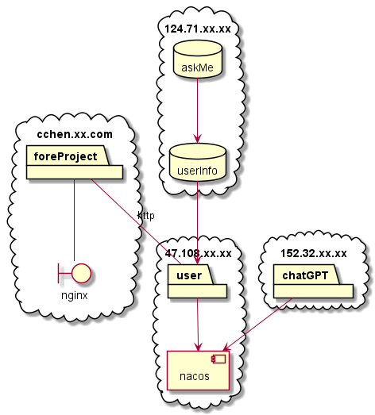

# askme

&nbsp;&nbsp;

askme 是一个基于 GPT-3.5-Turbo 模型的交互式网站项目。

Github: https://github.com/ITTranlationClub/askme

Demo: 

## 项目背景

### 业务背景

蹭一蹭 OpenAi 的东风, 搞点小玩意, 也算人生的产出

### 技术背景

实际开发过程中,随着业务量的增长,代码不可避免的产生大量的冗余,给开发人员带来极大的困难,对后续的维护来说,也是不小的挑战

最近阅读了一些源码,并结合自己日常的开发经验/问题,发现了一些 项目结构/规划 上的 银弹 ; 借这个机会整理出来,抛砖引玉,一起成长

由于微服务组件多\版本多的特点, 实际从零到一创建微服务时, 如何找到适配的版本是一个很大的问题;

当前项目采用目前最新的/稳定的/持续维护的依赖版本,避免版本依赖问题影响开发进度

### 一点想法

平时开发时,喜欢使用 [阿里Spring脚手架](https://start.aliyun.com/bootstrap.html) 创建项目, 最近发现初始化项目时,不能预选择项目结构了;

我在想是 **网站出了问题无法预定义项目结构** 了呢, 还是 **原先的maven结构已经跟不上时代** 了呢;

有幸又看到了一些开源项目, 学到了很多有趣的 **父子项目结构写法** **Bean加载方法** 

本着学以致用的目的, 创建了本项目;

如果项目对您有一些启发, 欢迎您 star 一下 [爱你](https://github.com/ITTranlationClub/askme/star)

如果发现项目的不足与需要改进的点, 欢迎您 [issue](https://github.com/ITTranlationClub/askme/issues) 提交您的看法, 我们会第一时间修改. 更爱你

如果您想要亲自动手修改项目结构, 分享并实践您的构思, 我们会超级超级滴爱你 [Fork一下](https://github.com/ITTranlationClub/askme/fork)

> 学习过程中, 愈发觉得应该有一本书教授 项目结构 相关的知识, 假如您知道这本书, 非常希望您可以推荐给我们, 我们会超级超级超级开心 [issue](https://github.com/ITTranlationClub/askme/issues)

## 技术栈

- [Nacos](https://nacos.io/zh-cn/)
- [Spring Cloud Alibaba](https://spring.io/projects/spring-cloud-alibaba/)
- [Dubbo](https://cn.dubbo.apache.org/zh-cn/)
- [Sa-Token](https://sa-token.cc/)
- [WxJava](https://github.com/Wechat-Group/WxJava)

## 当前功能

- 基于 sa-token wxJava 实现用户登录\鉴权功能
- 基于 openAi 实现ai交流功能

## 待实现功能

- 基于nacos实现配置信息动态加载
- 基于nacos实现IP访问限制
- 基于nacos实现业务内网关
- 基于nginx实现限流功能

## 项目部署图

## 项目结构图

父子项目含义:

- askme: 管理诸如 "spring.cloud.alibaba.xxx-xxx-dependencies"等依赖
  - askme-base: 项目基础包
    - askme-common: 公共模块包
    - askme-utils: 公共工具类包
  - askme-chatgpt: chatgpt 相关业务包
  - askme-gateway: 网关配置包
  - askme-main: 主要业务包
  - askme-parent: 公共具体依赖包
  - askme-remote-api:  远程调用接口依赖管理包
    - askme-chatgpt-remote-api: 远程调用接口定义包
  - askme-start-parent: 自定义 bean加载 管理包
    - xxx-start-askme: 自定义bean加载 实现包

## 经验之谈

### 如何管理实体类, 业务模块应该包含什么:

遵循单一职责原则:

- 数据在不同的层级/用途一定 定义 其对应实体类: po dto vo
- 即使不同模块间 po vo 完全相同, 也不能将其放入 common 包
- dto 等公用实体类可以放入 common 包
- 业务相关的代码, 都在业务模块下

### 如何管理 Bean配置类:

- 创建单独的 maven 项目, 编写需要的 Config 类
- 通过 Spring 自动注入机制, 声明我们需要注入的类文件
- 使用者通过 maven 引入项目, 并添加必要的配置信息即可

### 如何优雅的定义远程调用接口:

- 创建单独的 maven 项目,声明远程接口所需配置信息
- 编写服务对应的消费者/提供者注解, 通过 @Import 注解引入对应配置
- 在启动类添加对应注解, 不侵入的方式引入远程方法

未完待续 .......

## 如何贡献

非常欢迎你的加入！[提一个 Issue](https://github.com/ITTranlationClub/askme/issues/new) 或者提交一个 Pull Request。

### 贡献者 ✨

感谢以下参与项目的人：

## 使用许可

[MIT](LICENSE) © Richard Littauer

